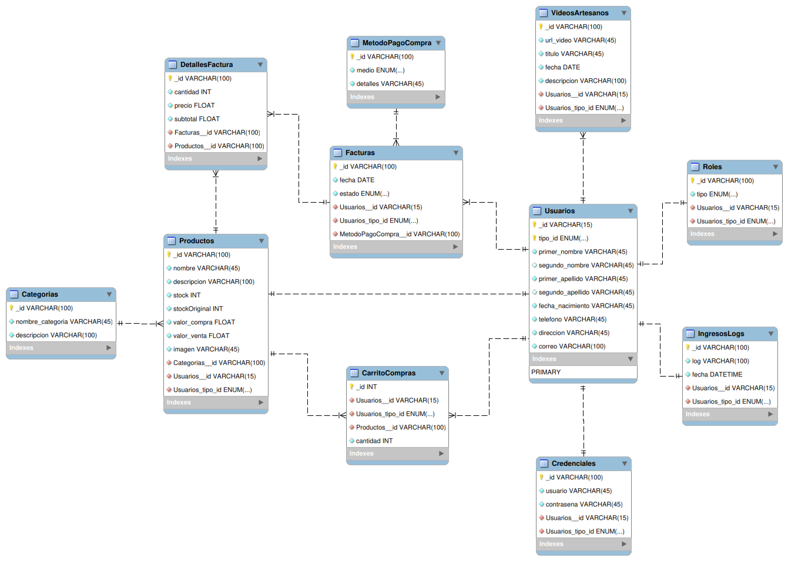

# Base de Datos Artesanías - README

 

## Descripción
La base de datos "Artesanías" es un sistema de gestión de información diseñado para administrar datos relacionados con una tienda de artesanías en línea. Esta base de datos se ha diseñado con la intención de ofrecer funcionalidades para la gestión de usuarios, productos, pedidos, facturación y más. A continuación, se describen las principales tablas y su estructura.

## Tablas Principales

<table>
  <thead>
    <tr>
      <th>Tabla</th>
      <th>Descripción</th>
      <th>Campos Clave</th>
      <th>Relaciones</th>
    </tr>
  </thead>
  <tbody>
    <tr>
      <td>Usuarios</td>
      <td>Almacena información sobre los usuarios registrados en el sistema, como clientes, artesanos y administradores.</td>
      <td>_id y tipo_id</td>
      <td>Relación con la tabla Roles mediante _id y tipo_id.</td>
    </tr>
    <tr>
      <td>Roles</td>
      <td>Define los roles de usuario (Cliente, Artesano, Admin) y asigna a los usuarios un rol específico.</td>
      <td>_id</td>
      <td>Relación con la tabla Usuarios mediante _id y tipo_id.</td>
    </tr>
    <tr>
      <td>Categorias</td>
      <td>Almacena las categorías de productos disponibles en la tienda de artesanías.</td>
      <td>_id</td>
      <td>Relación con la tabla Productos mediante Categorias__id.</td>
    </tr>
    <tr>
      <td>Productos</td>
      <td>Contiene información detallada sobre los productos disponibles, incluyendo precio, stock, descripción, y más.</td>
      <td>_id</td>
      <td>Relación con la tabla Categorias mediante Categorias__id.</td>
    </tr>
    <tr>
      <td>MetodoPagoCompra</td>
      <td>Almacena los métodos de pago disponibles para las compras.</td>
      <td>_id</td>
      <td></td>
    </tr>
    <tr>
      <td>Facturas</td>
      <td>Registra las facturas generadas a partir de los pedidos realizados por los clientes.</td>
      <td>_id</td>
      <td>Relación con las tablas Usuarios y MetodoPagoCompra.</td>
    </tr>
    <tr>
      <td>DetallesFactura</td>
      <td>Almacena información detallada sobre los productos incluidos en cada factura, incluyendo cantidad, precio y subtotal.</td>
      <td>_id</td>
      <td>Relación con las tablas Facturas y Productos.</td>
    </tr>
    <tr>
      <td>Credenciales</td>
      <td>Almacena las credenciales de acceso de los usuarios al sistema.</td>
      <td>_id</td>
      <td>Relación con la tabla Usuarios.</td>
    </tr>
    <tr>
      <td>VideosArtesanos</td>
      <td>Registra videos relacionados con los artesanos y sus productos.</td>
      <td>_id</td>
      <td>Relación con la tabla Usuarios.</td>
    </tr>
    <tr>
      <td>IngresosLogs</td>
      <td>Registra registros de ingresos de usuarios al sistema, incluyendo detalles y fecha.</td>
      <td>_id</td>
      <td>Relación con la tabla Usuarios.</td>
    </tr>
  </tbody>
</table>

## Configuración
Para utilizar esta base de datos, se deben seguir los siguientes pasos:

1. Crear una base de datos llamada "Artesanias" con el conjunto de caracteres "utf8" y la colación "utf8_general_ci".
2. Ejecutar el script SQL proporcionado en un cliente MySQL (como MySQL Workbench) para crear todas las tablas y relaciones.
3. Configurar las conexiones de la aplicación para conectarse a la base de datos utilizando las credenciales adecuadas.

## Relaciones
La base de datos "Artesanías" utiliza claves primarias y foráneas para establecer relaciones entre las tablas. Estas relaciones garantizan la integridad de los datos y facilitan la consulta de información relacionada.

## Notas Adicionales
- Se han utilizado tipos de datos adecuados para cada campo, como VARCHAR, ENUM, FLOAT, INT y DATETIME, para asegurar la precisión de los datos almacenados.
- La base de datos incluye restricciones de integridad referencial para mantener la coherencia de los datos.

Esta base de datos proporciona una sólida infraestructura para administrar una tienda de artesanías en línea, permitiendo la gestión eficiente de usuarios, productos, pedidos y facturación. Se puede personalizar y ampliar según las necesidades específicas del proyecto.

**Nota:** Asegúrese de mantener las credenciales de acceso a la base de datos seguras y de acuerdo con las prácticas recomendadas de seguridad de bases de datos.
